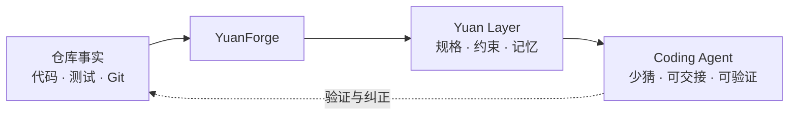

# YuanForge

<p align="center">
  
</p>

<p align="center">
  <strong>Forge the metadata your agents build by.</strong><br>
  锻造项目元数据，让 Agent 有据可循。
</p>

让 Agent 第一次走进仓库，就能回答三件事：

**这个项目要做什么？哪些约束不能碰？下一步从哪里继续？**

YuanForge 是一个项目基线 Skill。它从代码、测试、契约、Git 和已有文档中找回事实，把散落的上下文锻造成一层可维护的项目元数据：**Yuan Layer**。

它不替你开发，也不要求每个任务都走一遍流程。基线建好以后，仓库自己的文档会接管日常协作，YuanForge 就可以退场了。

## 为什么叫 Yuan

`Yuan` 指向“元”：项目的起点，也是描述项目的元数据。

代码负责运行，Yuan Layer 负责告诉人和 Agent：代码为什么这样运行、应该怎样继续演化。

## 它怎么工作



YuanForge 只做四件事：

| 操作 | 什么时候用 |
|---|---|
| `bootstrap` | 项目还没有一套可信基线 |
| `audit` | 怀疑文档和代码已经对不上 |
| `repair` | 已确认基线缺失、冲突或失真 |
| `evolve` | 项目经验需要沉淀成长期规则 |

## 它会留下什么

| 层次 | 规范归属 |
|---|---|
| 意图 | `PRD.md`、`APP_FLOW.md` |
| 结构 | `TECH_STACK.md`、前端与后端结构文档 |
| 交付 | `IMPLEMENTATION_PLAN.md` |
| 控制 | 精炼的 `AGENTS.md`、`WORKTREE_GUIDE.md` |
| 记忆 | 当前快照 `progress.txt`、经验规则 `lessons.md` |

文件名是默认约定，不是死模板。已有文档已经稳定承担某项职责时，YuanForge 会复用它，不会再造一套“真相”。

默认还会规划四类 Worktree：稳定集成、实验、文档和临时排查。真实名称与路径以项目现状为准。

## 安装

```bash
git clone https://github.com/lzxgogogo/YuanForge.git
mkdir -p ~/.codex/skills
cp -R YuanForge/skills/yuanforge ~/.codex/skills/yuanforge
```

PowerShell：

```powershell
git clone https://github.com/lzxgogogo/YuanForge.git
Copy-Item -Recurse -Force .\YuanForge\skills\yuanforge "$env:USERPROFILE\.codex\skills\yuanforge"
```

安装后新建一个 Codex 任务，让 Codex 重新发现 Skill。

## 使用

建立或补齐项目基线：

```text
$yuanforge bootstrap 当前仓库。
以仓库证据为准，实际创建或映射项目基线，不要覆盖已有事实源。
```

只做审计，不改文件：

```text
$yuanforge audit 当前 Yuan Layer。
对照代码、测试、契约、迁移、Git 和真实 Worktree，找出缺失与漂移。
```

修复已确认的问题：

```text
$yuanforge repair 已确认的基线问题，并验证链接、命令和 Worktree。
```

沉淀项目偏好：

```text
$yuanforge 从用户纠正、评审、progress.txt 和 lessons.md 中，
提出有证据、可审查的 Yuan Layer 演化方案。
```

## 对中途项目更有用

YuanForge 不假设项目是白纸。

它会先检查已有代码、文档和 Git 状态，把现有材料映射到 Yuan Layer，再补真正缺失的部分。没有预期文件名，不代表没有项目知识；已经有文档，也不代表它仍然是真相。

它会保留未提交修改和已有 Worktree，不会为了套模板而推倒重来。

## 几条底线

- 仓库证据优先于聊天记忆和合理猜测。
- 一个长期事实只保留一个规范归属。
- `AGENTS.md` 是入口，不是项目百科；约 60 行只是膨胀提醒。
- 文档语言跟随用户和项目，代码标识符与协议字段保持原样。
- 项目偏好留在项目里，不让一个仓库静默改写全局 Skill。
- 没有新鲜验证，就不声称基线已经完成。
- 基线稳定后，普通开发任务不再需要调用 YuanForge。

更完整的职责模型见 [Yuan Layer](docs/YUAN_LAYER.md)。Skill 的执行细节在 [skills/yuanforge](skills/yuanforge)。

## 状态

YuanForge 仍是早期自用版本。结构已经通过 Codex Skill 校验，也在真实项目讨论中持续自举；接下来需要更多不同类型仓库的 Bootstrap、Audit 和 Evolve 测试。

MIT License
