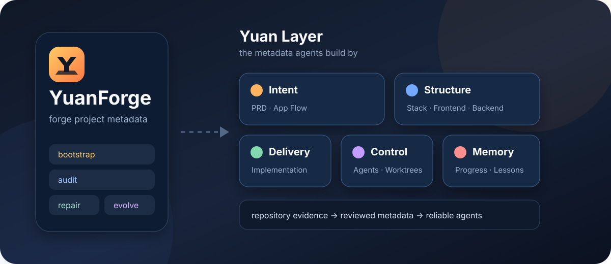
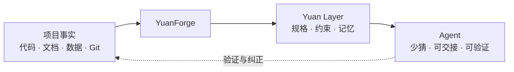

# YuanForge

<p align="center">
  
</p>

<p align="center">
  <strong>Forge the metadata your agents build by.</strong><br>
  锻造项目元数据，让 Agent 有据可循。
</p>

让 Agent 第一次走进项目仓库，就能回答三件事：

**这个项目要做什么？哪些约束不能碰？下一步从哪里继续？**

YuanForge 为长期 Agent 协作的 Git 仓库建立项目基线。它从代码、文档、测试、数据、来源、产物和历史中找回事实，把散落的上下文锻造成一层可维护的项目元数据：**Yuan Layer**。

它也会区分“项目现在怎样工作”和“项目应该怎样工作”。代码可以证明现状，却不能替你决定产品体验；目标意图缺失时，YuanForge 会先逐项澄清，再写入稳定基线。

它不替你开发、研究或管理项目，也不要求每个任务都走一遍流程。基线建好以后，仓库自己的文档会接管日常协作，YuanForge 就可以退场了。

## 为什么叫 Yuan

`Yuan` 指向“元”：项目的起点，也是描述项目的元数据。

代码负责运行，Yuan Layer 负责告诉人和 Agent：代码为什么这样运行、应该怎样继续演化。

## 它怎么工作



YuanForge 只做四件事：

| 操作 | 什么时候用 |
|---|---|
| `bootstrap` | 项目还没有一套可信基线 |
| `audit` | 怀疑文档和代码已经对不上 |
| `repair` | 已确认基线缺失、冲突或失真 |
| `evolve` | 项目经验需要沉淀成长期规则 |

## 它会留下什么

| 层次 | 规范归属 |
|---|---|
| 意图与流程 | `PROJECT_BRIEF.md`、`WORKFLOW.md`，或已有 PRD、研究方案 |
| 方法与结构 | `METHODS.md`、`PROJECT_STRUCTURE.md`，或已有技术、证据结构文档 |
| 交互与交付 | `INTERACTION_GUIDE.md`、`DELIVERY_PLAN.md`，或项目已有等价物 |
| 控制 | 精炼的 `AGENTS.md`、`WORKTREE_GUIDE.md` |
| 记忆 | 当前快照 `progress.txt`、经验规则 `lessons.md` |

固定的是意图、流程、方法、交互、结构、交付六类职责，不是文件名。软件、研究、数据、文档和混合项目会选择不同表达；已有文档稳定承担职责时，YuanForge 会复用它。

对有界面的软件项目，流程不只是后端流水线。YuanForge 会检查角色、入口、页面、动作、状态、成功与错误恢复、路由和权限；缺少这些内容时，`APP_FLOW.md`、`PRODUCT_FLOW.md` 或已有等价物不能被 API 清单代替。

复杂领域通过可选“证据画像”增强。画像负责从源码、运行时或领域产物中取证，YuanForge 仍负责就绪判断和规范归属；没有画像或专用工具时，基础 Bootstrap 仍可独立完成，并明确披露证据缺口。

默认会规划四类 Worktree：稳定集成、实验、文档和临时排查。角色预先定义，实体按需创建；真实名称、路径和数量以项目现状为准。

## 安装

```bash
git clone https://github.com/lzxgogogo/YuanForge.git
mkdir -p ~/.codex/skills/yuanforge
cp -R YuanForge/skills/yuanforge/. ~/.codex/skills/yuanforge/
```

PowerShell：

```powershell
git clone https://github.com/lzxgogogo/YuanForge.git
$target = "$env:USERPROFILE\.codex\skills\yuanforge"
New-Item -ItemType Directory -Force $target | Out-Null
Get-ChildItem -Force .\YuanForge\skills\yuanforge | Copy-Item -Destination $target -Recurse -Force
```

安装后新建一个 Codex 任务，让 Codex 重新发现 Skill。

## 使用

建立或补齐项目基线：

```text
$yuanforge bootstrap 当前仓库。
以仓库证据为准，实际创建或映射项目基线，不要覆盖已有事实源。
```

只做审计，不改文件：

```text
$yuanforge audit 当前 Yuan Layer。
对照代码、测试、契约、迁移、Git 和真实 Worktree，找出缺失与漂移。
```

修复已确认的问题：

```text
$yuanforge repair 已确认的基线问题，并验证链接、命令和 Worktree。
```

沉淀项目偏好：

```text
$yuanforge 从用户纠正、评审、progress.txt 和 lessons.md 中，
提出有证据、可审查的 Yuan Layer 演化方案。
```

## 适用边界

YuanForge 面向让 Agent 在 Git 仓库中持续工作的个人与团队，尤其适合上下文已经分散、文档可能漂移的中途项目。

软件、研究、数据、文档和混合项目都可以使用，前提是主要产物、约束和验证证据能够保存在仓库中。六类职责可以组合项目画像，不要求项目只能属于一种类型。

一次性任务、主要状态存在外部业务系统或线下执行中的项目，不是当前承诺范围。YuanForge 不会把仓库中不存在的事实猜成完整项目状态。

## 几条底线

- 仓库证据优先于聊天记忆和合理猜测。
- 当前实现证明“是什么”，不能单独决定“应该是什么”。
- 一个长期事实只保留一个规范归属。
- `AGENTS.md` 是入口，不是项目百科；约 60 行只是膨胀提醒。
- 文档语言跟随用户和项目，代码标识符与协议字段保持原样。
- 项目偏好留在项目里，不让一个仓库静默改写全局 Skill。
- 没有新鲜验证，就不声称基线已经完成。
- 基线稳定后，普通开发、研究和项目任务不再需要调用 YuanForge。

更完整的职责模型见 [Yuan Layer](docs/YUAN_LAYER.md)。Skill 的执行细节在 [skills/yuanforge](skills/yuanforge)。

## 状态

YuanForge 仍是早期自用版本。结构已经通过 Codex Skill 校验，并用自身仓库完成首轮 Bootstrap；下一阶段是用 `evals/cases.json` 在不同类型的真实仓库中做独立前向验证。

MIT License
